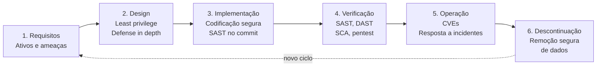
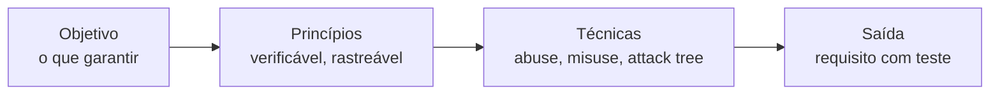
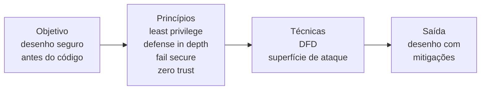

# Ponto 1 — Ciclo de vida de desenvolvimento seguro e DevSecOps

## Objetivo

Entender o SDLC seguro: o que é, as seis fases, as técnicas de cada fase, e como o DevSecOps executa esse ciclo de forma contínua e automatizada.

---

## 1. Overview visual — o ciclo completo

A lógica central: quanto mais cedo a segurança entra, mais barato é corrigir. Uma falha no commit custa horas; a mesma em produção custa dias ou semanas.

---

## 2. As seis fases do SDLC seguro

O SDLC seguro é o mesmo ciclo de vida de software, com segurança embutida em cada fase — não um teste no final.

### Fase 1 — Requisitos

Ordem: objetivo → princípios → técnicas → saída.

#### Objetivo

Identificar ativos, classificar dados e escrever requisitos de segurança verificáveis. Responde o que o sistema deve garantir, não como implementar.

**O que se faz:**

| Atividade | O que é |
|---|---|
| Identificar ativos | dados, segredos, funções, infra — o que vale proteger |
| Classificar dados | Público, Interno, Confidencial, Restrito |
| Escrever requisitos | traduzir ativo e classificação em comportamento testável |

**O que se produz:**

| Produto | O que é |
|---|---|
| Tipo de requisito | funcional, não funcional, restrição |
| Premissas | o que assume e o que não promete |
| Critério de aceite | o teste que prova que o requisito funciona |

**A lente da classificação:**

CIA — Confidencialidade, Integridade, Disponibilidade. Não é atividade nem produto: é o critério que você aplica ao classificar cada dado.

#### Princípios

| Princípio | Regra |
|---|---|
| Verificabilidade | se não dá para testar, não serve |
| Rastreabilidade | ativo → requisito → controle → teste |
| Negação explícita | o que não deve acontecer vira requisito negativo |

Regra de ouro: ruim = "seja seguro". Bom = "rota autenticada rejeita token expirado com 401".

#### Técnicas

Técnicas de elicitação da literatura. Ativo e classificação alimentam a técnica; não são a técnica.

| Técnica | Quem | O que faz |
|---|---|---|
| Abuse case | McDermott e Fox, 1999 | outsider tenta quebrar, roubar ou derrubar |
| Misuse case | Sindre e Opdahl, 2000 | insider faz o que não deve; inverte o caso de uso |
| Confuse case | extensão dos misuse cases | insider erra sem intenção |
| Attack tree | Schneier | objetivo na raiz; cada ramo é um caminho |
| Bug bar | Microsoft SDL | limiar do que não pode ir para release |

Apoio, não técnica: OWASP ASVS é catálogo de requisito testável. SQUARE (Mead, SEI) é o processo que escolhe a técnica.

#### Saída

Requisito com critério de aceite. Sem teste, não entrou no ciclo.

### Fase 2 — Design

Ordem: objetivo → princípios → técnicas → saída.

É a fase mais barata para corrigir erro: mudar um desenho custa uma reunião; reescrever código custa meses.

#### Objetivo

Definir a arquitetura segura do sistema antes de escrever código: onde os dados fluem, onde entram as ameaças, e quais controles mitigam cada uma.

| Atividade | O que é |
|---|---|
| Diagrama de fluxo de dados | processos, armazenamentos, fluxos |
| Superfície de ataque | pontos de entrada do sistema |
| Mitigação | controle que reduz a ameaça |

#### Princípios

| Princípio | Regra |
|---|---|
| Least privilege | mínimo de acesso por componente |
| Defense in depth | várias camadas; uma falha não derruba tudo |
| Fail secure | erro nega acesso, nunca libera |
| Zero trust | verificar sempre, nunca confiar por padrão |

Regra de ouro: design errado custa uma reunião; código errado custa meses.

#### Técnicas

| Técnica | Quem | O que faz |
|---|---|---|
| Diagrama de fluxo de dados (DFD) | DeMarco, 1979 | processos, armazenamentos e fluxos; base para aplicar os princípios |
| Análise de superfície de ataque | Manadhata e Wing, 2004 | lista pontos de entrada e prioriza por risco |

Apoio, não técnica: STRIDE (Microsoft) é a taxonomia de ameaças que alimenta a análise. Modelagem de ameaças é o ponto 2 do programa.

#### Saída

Desenho com ameaças mapeadas e mitigações definidas. Sem mitigação, o desenho não saiu da fase.

### Fase 3 — Implementação

**Objetivo:** escrever código sem os padrões de falha conhecidos.

| Atividade | O que é |
|---|---|
| Codificação segura | evitar buffer overflow, SQL injection, funções inseguras |
| Revisão de código | olhar de segurança no pull request |

**Técnica:** nenhuma técnica nomeada nesta fase — a técnica de verificação (SAST) roda no commit e cobre a implementação.

### Fase 4 — Verificação

**Objetivo:** encontrar falhas antes de produção, com evidência.

| Atividade | O que é |
|---|---|
| SAST | analisa código-fonte sem executar |
| DAST | testa a aplicação rodando, como atacante |
| SCA | verifica dependências de terceiros |
| Pentest | simula ataque real |

**Técnicas:** SAST, DAST, SCA e pentest são as técnicas de verificação — cada uma com método e ferramenta próprios. Detalhamento no ponto 7.

### Fase 5 — Operação

**Objetivo:** detectar e responder a falhas em produção sem derrubar o serviço.

| Atividade | O que é |
|---|---|
| Rastreio de CVEs | saber quais afetam o que roda |
| Resposta a incidentes | conter, erradicar, recuperar |
| Patch management | corrigir sem downtime |

**Técnica:** nenhuma técnica nomeada nesta fase — o monitoramento é prática operacional, não método de elicitação ou análise.

### Fase 6 — Descontinuação

**Objetivo:** encerrar o sistema sem vazar dados nem deixar credenciais ativas.

| Atividade | O que é |
|---|---|
| Remoção segura de dados | apagar ou anonimizar sem resíduo |
| Revogação de credenciais | invalidar tokens, chaves, senhas |
| Transferência controlada | passar dados para o sistema sucessor |

**Técnica:** nenhuma técnica nomeada nesta fase — é checklist de encerramento.

---

## 3. Por que segurança cedo custa menos

### A regra

Uma falha no commit custa horas. A mesma falha em produção custa dias ou semanas.

### Por quê

- No commit, o código é pequeno e o contexto está fresco.
- Em produção, a falha já afetou dados, clientes ou receita.
- Corrigir em produção exige investigação, rollback e comunicação com impactados.

### Exemplo

SQL injection corrigida no pull request: reescreve a query, adiciona teste. Fim.

A mesma em produção: incidente, investigação forense, notificação de clientes, patch emergencial fora do horário.

---

## 4. O que é DevSecOps

DevSecOps = **Development + Security + Operations**.

É a prática de integrar segurança no pipeline de CI/CD, de forma automatizada e contínua. Segurança deixa de ser etapa separada no final e roda junto com tudo.

O nome junta três áreas:

- **Development** — o time que escreve o código
- **Security** — a camada de segurança: ferramentas e práticas
- **Operations** — o time que cuida de deploy, monitoramento e infraestrutura

### A ideia central

Segurança passa a ser responsabilidade compartilhada pelos três, não de um time isolado. Cada commit dispara verificações automáticas; se algo falhar, o pipeline bloqueia o deploy.

### O oposto

Modelo tradicional: o time de segurança recebia o sistema pronto, fazia um pentest no final, encontrava falhas caras e devolvia. Todo mundo perdia tempo.

---

## 5. Shift-left e shift-right

Duas práticas centrais do DevSecOps.

### Shift-left

Trazer segurança para o mais cedo possível. Em vez de testar no final, testar em cada commit: SAST no push, SCA nas dependências, secrets scanning antes do merge.

### Shift-right

Monitorar em produção. CVEs novos aparecem todo dia; o time precisa saber quais afetam o que roda e responder rápido.

### Juntas

Shift-left previne. Shift-right detecta. Um sem o outro deixa buracos: só shift-left ignora o que já está em produção; só shift-right corrige tarde demais.

---

## 6. Pipeline de CI/CD com segurança

O pipeline é a sequência automatizada de etapas do commit ao deploy. Com segurança embutida, cada etapa ganha uma verificação.

### Etapas típicas

1. **Commit** — o desenvolvedor envia o código
2. **Build** — compilação ou empacotamento
3. **Testes** — testes automatizados
4. **Análise de segurança** — SAST, SCA, secrets scanning
5. **Deploy em staging** — ambiente de teste
6. **DAST** — a aplicação rodando é testada como um atacante
7. **Deploy em produção** — só se tudo passou

### Regra de ouro

Se uma verificação falhar, o pipeline para. Nada vai para produção com falha de segurança conhecida.

---

## 7. Ferramentas do DevSecOps

Cada letra do DevSecOps tem ferramentas correspondentes.

### SAST — Static Application Security Testing

Analisa o código-fonte sem executá-lo. Encontra padrões de falha conhecidos: SQL injection, buffer overflow, funções inseguras.

Exemplos: Semgrep, SonarQube, CodeQL.

### DAST — Dynamic Application Security Testing

Testa a aplicação rodando, como um atacante. Envia requisições maliciosas e observa as respostas.

Exemplos: OWASP ZAP, Burp Suite.

### SCA — Software Composition Analysis

Verifica dependências de terceiros. Bibliotecas com CVEs conhecidas são sinalizadas.

Exemplos: Dependabot, Snyk, Trivy.

### Fuzzing

Envia entradas aleatórias ou malformadas e observa se o programa quebra. Bom para falhas de memória e parsing.

### Secrets scanning

Procura credenciais vazadas no código: senhas, tokens, chaves de API.

Exemplos: GitGuardian, gitleaks, trufflehog.

---

## 8. SDLC seguro vs DevSecOps

### SDLC seguro

É o **processo**: as seis fases com segurança embutida. Responde "o que fazer em cada fase".

### DevSecOps

É a **prática**: como esse processo roda no dia a dia, com segurança automatizada no pipeline. Responde "como garantir que a segurança aconteça em cada fase, de forma contínua".

### Resumo

| | SDLC seguro | DevSecOps |
|---|---|---|
| Natureza | Processo | Prática |
| Pergunta | O que fazer? | Como fazer? |
| Escala | Qualquer projeto | Projetos com CI/CD |

Um não substitui o outro: o DevSecOps é a forma de executar o SDLC seguro em escala.

---

## 9. Técnicas para memorizar

| Fase / Conceito | Objetivo | Princípio | Técnica |
|---|---|---|---|
| Requisitos | requisito verificável | verificável, rastreável, negação explícita | abuse case, misuse case, confuse case, attack tree, bug bar |
| Design | desenho seguro antes do código | least privilege, defense in depth, fail secure, zero trust | DFD, superfície de ataque |
| Implementação | código sem falha conhecida | — | — (SAST no commit cobre) |
| Verificação | falha encontrada com evidência | — | SAST, DAST, SCA, pentest |
| Operação | falha detectada e respondida | — | — (monitoramento operacional) |
| Descontinuação | encerramento sem vazamento | — | — (checklist) |
| DevSecOps | segurança no pipeline | responsabilidade compartilhada | Dev + Sec + Ops integrados |
| Shift-left | segurança no início do ciclo | — | — |
| Shift-right | monitoramento em produção | — | — |

---

## Referências

- Microsoft SDL — learn.microsoft.com (procure "Security Development Lifecycle")
- NIST SSDF — nist.gov/publications/sp-800-218
- OWASP SAMM — owaspsamm.org
- OWASP ASVS — catálogo de requisitos verificáveis
- Misuse cases — Sindre e Opdahl, Requirements Engineering, 2005
- Abuse cases — McDermott e Fox, 1999
- SQUARE — Mead, SEI
- DFD — DeMarco, 1979
- Superfície de ataque — Manadhata e Wing, 2004
