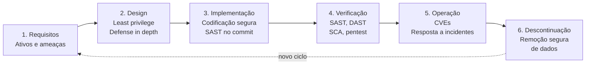

# Ponto 1 — Ciclo de vida de desenvolvimento seguro e DevSecOps

## Objetivo

Entender o SDLC seguro: o que é, as seis fases, as técnicas de cada fase, e como o DevSecOps executa esse ciclo de forma contínua e automatizada.

---

## 1. Overview visual — o ciclo completo

A lógica central: quanto mais cedo a segurança entra, mais barato é corrigir. Uma falha no commit custa horas; a mesma em produção custa dias ou semanas.

---

## 2. As seis fases do SDLC seguro

O SDLC seguro é o mesmo ciclo de vida de software, com segurança embutida em cada fase — não um teste no final.

### Fase 1 — Requisitos

**Técnica:** identificação de ativos + análise de ameaças + especificação de requisitos de segurança.

Definir o que precisa ser protegido e por quê. Ativos: dados de clientes, credenciais, dinheiro, chaves de API, código-fonte. Ameaças: acesso indevido, alteração, destruição, indisponibilidade. A saída é uma lista de requisitos — "o que o sistema deve garantir", não "como fazer".

Exemplo de requisito: "todo acesso exige autenticação", "dados sensíveis criptografados em trânsito".

### Fase 2 — Design

**Técnica:** arquitetura segura com princípios de design.

Aplicar least privilege — cada componente recebe só o mínimo de acesso necessário — e defense in depth — várias camadas de proteção, para que uma falha não derrube tudo. Também fail secure — em caso de erro, o sistema nega acesso — e zero trust — nunca confiar automaticamente, verificar sempre.

É a fase mais barata para corrigir erro: mudar um desenho custa menos que reescrever código.

### Fase 3 — Implementação

**Técnica:** codificação segura.

Evitar padrões conhecidos de falha: buffer overflow, SQL injection, uso de funções inseguras. Revisão de código com olhar de segurança. SAST rodando em cada commit.

### Fase 4 — Verificação

**Técnica:** testes de segurança.

SAST analisa o código-fonte sem executá-lo. DAST testa a aplicação rodando, como um atacante. SCA verifica dependências de terceiros. Pentest simula ataque real.

### Fase 5 — Operação

**Técnica:** monitoramento e resposta.

Rastrear CVEs e saber quais afetam o que roda. Resposta a incidentes. Patch management sem derrubar o serviço.

### Fase 6 — Descontinuação

**Técnica:** descomissionamento seguro.

Remoção segura de dados. Revogação de credenciais. Transferência controlada.

---

## 3. Por que segurança cedo custa menos

### A regra

Uma falha no commit custa horas. A mesma falha em produção custa dias ou semanas.

### Por quê

- No commit, o código é pequeno e o contexto está fresco.
- Em produção, a falha já afetou dados, clientes ou receita.
- Corrigir em produção exige investigação, rollback e comunicação com impactados.

### Exemplo

SQL injection corrigida no pull request: reescreve a query, adiciona teste. Fim.

A mesma em produção: incidente, investigação forense, notificação de clientes, patch emergencial fora do horário.

---

## 4. O que é DevSecOps

DevSecOps = **Development + Security + Operations**.

É a prática de integrar segurança no pipeline de CI/CD, de forma automatizada e contínua. Segurança deixa de ser etapa separada no final e roda junto com tudo.

O nome junta três áreas:

- **Development** — o time que escreve o código
- **Security** — a camada de segurança: ferramentas e práticas
- **Operations** — o time que cuida de deploy, monitoramento e infraestrutura

### A ideia central

Segurança passa a ser responsabilidade compartilhada pelos três, não de um time isolado. Cada commit dispara verificações automáticas; se algo falhar, o pipeline bloqueia o deploy.

### O oposto

Modelo tradicional: o time de segurança recebia o sistema pronto, fazia um pentest no final, encontrava falhas caras e devolvia. Todo mundo perdia tempo.

---

## 5. Shift-left e shift-right

Duas práticas centrais do DevSecOps.

### Shift-left

Trazer segurança para o mais cedo possível. Em vez de testar no final, testar em cada commit: SAST no push, SCA nas dependências, secrets scanning antes do merge.

### Shift-right

Monitorar em produção. CVEs novos aparecem todo dia; o time precisa saber quais afetam o que roda e responder rápido.

### Juntas

Shift-left previne. Shift-right detecta. Um sem o outro deixa buracos: só shift-left ignora o que já está em produção; só shift-right corrige tarde demais.

---

## 6. Pipeline de CI/CD com segurança

O pipeline é a sequência automatizada de etapas do commit ao deploy. Com segurança embutida, cada etapa ganha uma verificação.

### Etapas típicas

1. **Commit** — o desenvolvedor envia o código
2. **Build** — compilação ou empacotamento
3. **Testes** — testes automatizados
4. **Análise de segurança** — SAST, SCA, secrets scanning
5. **Deploy em staging** — ambiente de teste
6. **DAST** — a aplicação rodando é testada como um atacante
7. **Deploy em produção** — só se tudo passou

### Regra de ouro

Se uma verificação falhar, o pipeline para. Nada vai para produção com falha de segurança conhecida.

---

## 7. Ferramentas do DevSecOps

Cada letra do DevSecOps tem ferramentas correspondentes.

### SAST — Static Application Security Testing

Analisa o código-fonte sem executá-lo. Encontra padrões de falha conhecidos: SQL injection, buffer overflow, funções inseguras.

Exemplos: Semgrep, SonarQube, CodeQL.

### DAST — Dynamic Application Security Testing

Testa a aplicação rodando, como um atacante. Envia requisições maliciosas e observa as respostas.

Exemplos: OWASP ZAP, Burp Suite.

### SCA — Software Composition Analysis

Verifica dependências de terceiros. Bibliotecas com CVEs conhecidas são sinalizadas.

Exemplos: Dependabot, Snyk, Trivy.

### Fuzzing

Envia entradas aleatórias ou malformadas e observa se o programa quebra. Bom para falhas de memória e parsing.

### Secrets scanning

Procura credenciais vazadas no código: senhas, tokens, chaves de API.

Exemplos: GitGuardian, gitleaks, trufflehog.

---

## 8. SDLC seguro vs DevSecOps

### SDLC seguro

É o **processo**: as seis fases com segurança embutida. Responde "o que fazer em cada fase".

### DevSecOps

É a **prática**: como esse processo roda no dia a dia, com segurança automatizada no pipeline. Responde "como garantir que a segurança aconteça em cada fase, de forma contínua".

### Resumo

| | SDLC seguro | DevSecOps |
|---|---|---|
| Natureza | Processo | Prática |
| Pergunta | O que fazer? | Como fazer? |
| Escala | Qualquer projeto | Projetos com CI/CD |

Um não substitui o outro: o DevSecOps é a forma de executar o SDLC seguro em escala.

---

## 9. Técnicas para memorizar

| Fase / Conceito | Técnica |
|---|---|
| Requisitos | Identificar ativos e ameaças |
| Design | Least privilege + defense in depth |
| Implementação | Codificação segura |
| Verificação | SAST, DAST, SCA, pentest |
| Operação | Monitorar CVEs + resposta a incidentes |
| Descontinuação | Remoção segura de dados |
| DevSecOps | Dev + Sec + Ops integrados no pipeline |
| Shift-left | Segurança no início do ciclo |
| Shift-right | Monitoramento em produção |

---

## Referências

- Microsoft SDL — learn.microsoft.com (procure "Security Development Lifecycle")
- NIST SSDF — nist.gov/publications/sp-800-218
- OWASP SAMM — owaspsamm.org
