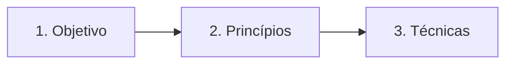

# LAB-SDLC-IA-SEC

Laboratório pessoal de estudo.

Aprendizado baseado em objetivo, princípios e técnicas. Cada ponto e cada fase usa as mesmas três seções, nessa ordem.

## Como usar

A apostila é gradual: cada pasta é um ponto do programa. Leia na ordem — cada ponto assume o anterior.

Leia cada seção até fechar a pergunta dela. Se a frase não cabe numa seção, ela não entra.

## Metodologia

### 1. Objetivo

O que esta fase tem que entregar.

Não entra passo, ferramenta nem princípio. Atividade (ativos, classificação, CIA) fica aqui: é o que se faz para chegar na entrega, não um método nomeado.

### 2. Princípios

Que regra não pode quebrar.

Uma regra por linha. Exemplo só se a linha sozinha mentir. Ferramenta não entra.

### 3. Técnicas

Qual método nomeado da literatura se usa.

Fonte na linha: quem e ano. Sem nome na literatura, não é técnica. Catálogo (ASVS) e processo (SQUARE) ficam no rodapé da seção, não na tabela.

| Seção | Pergunta | Não entra |
|---|---|---|
| Objetivo | O que entregar? | Princípio, técnica, ferramenta |
| Princípios | Que regra não quebra? | Exemplo longo, ferramenta |
| Técnicas | Qual método nomeado? | Atividade genérica |

Regras:

- Uma linha por célula.
- Objetivo do ponto fica no topo. Objetivo da fase fica dentro da fase.
- Diagrama repete as três seções.
- Apresentação segue o README. Se divergir, o README manda.

## Pontos

1. [Ciclo de vida de desenvolvimento seguro e DevSecOps](01-ciclo-de-vida-seguro/README.md)
2. [Modelagem de ameaças e análise de superfície de ataque](02-modelagem-de-ameacas/README.md)
3. [Princípios de arquitetura e projeto seguros](03-principios-de-arquitetura-segura/README.md)
4. [Vulnerabilidades em aplicações web](04-vulnerabilidades-em-aplicacoes-web/README.md)
5. [Práticas de codificação segura e erros de memória](05-praticas-de-codificacao-segura/README.md)
6. [Autenticação, autorização e gestão de sessão](06-autenticacao-autorizacao-sessao/README.md)
7. [Testes de segurança (SAST, DAST, SCA, fuzzing)](07-testes-de-seguranca/README.md)
8. [Segurança da cadeia de suprimentos de software](08-cadeia-de-suprimentos/README.md)
9. [Segurança de APIs, microsserviços e contêineres](09-seguranca-de-apis/README.md)
10. [Gestão de vulnerabilidades](10-gestao-de-vulnerabilidades/README.md)
