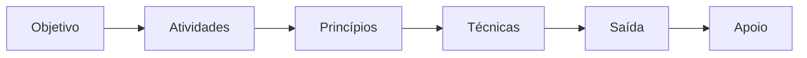

# LAB-SDLC-IA-SEC

Laboratório pessoal de estudo.

## Como usar

A apostila é gradual: cada pasta é um ponto do programa. Leia na ordem — cada ponto assume o anterior.

A escrita e a leitura seguem o mesmo molde. Se a frase não cabe num bloco, ela não entra.

## Metodologia

Ordem fixa, em todo ponto e em toda fase:

| Bloco | Pergunta | O que não entra |
|---|---|---|
| Objetivo | O que esta fase tem que entregar? | Passo, ferramenta, princípio |
| Atividades | O que se faz para chegar lá? | Nome de método da literatura |
| Princípios | Que regra não pode quebrar? | Exemplo longo, ferramenta |
| Técnicas | Qual método nomeado da literatura se usa? | Atividade genérica |
| Saída | O que existe no fim, e como se testa? | Intenção |
| Apoio | Catálogo ou processo que não é a técnica | Mesmo nível da técnica |

Regras:

- Uma linha por célula. Exemplo só se a linha sozinha mentir.
- Fonte só na técnica: quem e ano.
- Sem nome na literatura, não se chama técnica.
- Objetivo do ponto fica no topo. Objetivo da fase fica dentro da fase.
- Diagrama repete o molde. Não desenha o fluxo antigo.
- Apresentação segue o README. Se divergir, o README manda.

## Pontos

1. [Ciclo de vida de desenvolvimento seguro e DevSecOps](01-ciclo-de-vida-seguro/README.md)
2. [Modelagem de ameaças e análise de superfície de ataque](02-modelagem-de-ameacas/README.md)
3. [Princípios de arquitetura e projeto seguros](03-principios-de-arquitetura-segura/README.md)
4. [Vulnerabilidades em aplicações web](04-vulnerabilidades-em-aplicacoes-web/README.md)
5. [Práticas de codificação segura e erros de memória](05-praticas-de-codificacao-segura/README.md)
6. [Autenticação, autorização e gestão de sessão](06-autenticacao-autorizacao-sessao/README.md)
7. [Testes de segurança (SAST, DAST, SCA, fuzzing)](07-testes-de-seguranca/README.md)
8. [Segurança da cadeia de suprimentos de software](08-cadeia-de-suprimentos/README.md)
9. [Segurança de APIs, microsserviços e contêineres](09-seguranca-de-apis/README.md)
10. [Gestão de vulnerabilidades](10-gestao-de-vulnerabilidades/README.md)
