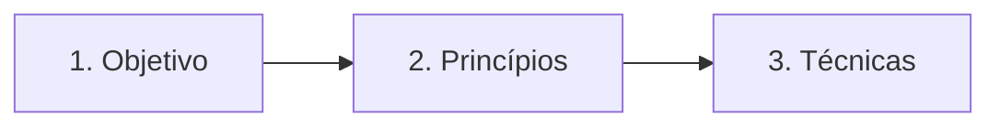
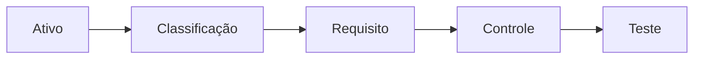

# LAB-SDLC-IA-SEC

Laboratório pessoal de estudo.

Aprendizado baseado em objetivo, princípios e técnicas. Cada ponto e cada fase usa as mesmas três seções, nessa ordem.

## Como usar

A apostila é gradual: cada pasta é um ponto do programa. Leia na ordem — cada ponto assume o anterior.

Leia cada seção até fechar a pergunta dela. Se a frase não cabe numa seção, ela não entra.

## Metodologia

### 1. Objetivo

O que esta fase tem que entregar.

Não entra passo, ferramenta nem princípio. Atividade fica aqui: é o que se faz para chegar na entrega, não um método nomeado.

### 2. Princípios

Que regra não pode quebrar.

Uma regra por linha. Exemplo só se a linha sozinha mentir. Ferramenta não entra.

### 3. Técnicas

Qual método nomeado da literatura se usa.

Fonte na linha: quem e ano. Sem nome na literatura, não é técnica. Catálogo e processo ficam no rodapé da seção, não na tabela.

| Seção | Pergunta | Não entra |
|---|---|---|
| Objetivo | O que entregar? | Princípio, técnica, ferramenta |
| Princípios | Que regra não quebra? | Exemplo longo, ferramenta |
| Técnicas | Qual método nomeado? | Atividade genérica |

Regras:

- Uma linha por célula.
- Objetivo do ponto fica no topo. Objetivo da fase fica dentro da fase.
- Diagrama repete as três seções.
- Apresentação segue o README. Se divergir, o README manda.

## Hierarquia de estudo: princípio, técnica, mecanismo

Três camadas, da regra à execução:

| Camada | Pergunta |
|---|---|
| Princípio | Que regra não quebra? |
| Técnica | Qual método nomeado revela onde aplicar? |
| Mecanismo | O que executa a regra? |

Regras:

- Princípio é regra de restrição, não procedimento. Diz o que não pode falhar; não diz como fazer.
- Técnica é método com nome na literatura, com fonte (quem, ano). Sem nome, não é técnica.
- Mecanismo é a implementação concreta.
- Nem toda técnica tem mecanismo. Nem todo mecanismo tem técnica associada.
- A tríade funciona quando os três existem; quando falta um, registra só o que tem.

## Estrutura de raciocínio: rastreabilidade

A cadeia que liga o que proteger ao que prova que protege:

Três perguntas, uma por elo:

| Elo | Pergunta | Responde |
|---|---|---|
| Ativo | O que vale proteger? | O quê |
| Classificação | O quanto proteger? | Quanto |
| Requisito | O que o sistema deve fazer? | Como |

A cadeia completa fecha o circuito: ativo → classificação → requisito → controle → teste. O teste é o que prova que o requisito funciona, e é o elo que volta pro ativo.

Regras:

- Ativo, classificação e requisito são a estrutura de raciocínio da fase de requisitos — não são técnicas.
- A classificação é a ponte entre o ativo e o requisito: define o nível de sensibilidade e o tratamento obrigatório.
- Sem a corrente completa, o requisito não é rastreável: ninguém sabe de onde veio nem como provar que funciona.

## Método de estudo

O README guarda estruturas de raciocínio e processos de aprendizagem — não exemplos específicos. Exemplos vivem nos exercícios e nas pastas dos pontos.

- **Retrieval practice**: fechar o material e tentar lembrar de cabeça. Se travar, reler só aquele ponto e tentar de novo no dia seguinte.
- **Pergunta em vez de definição**: cada conceito vira pergunta. "O que é ativo?" vira "o que vale proteger nesse sistema?" — a resposta é sempre concreta.
- **Estrutura antes de conteúdo**: primeiro o molde (objetivo, princípios, técnicas), depois o preenchimento. O molde é o que se memoriza; o conteúdo é o que se aplica.

## Pontos

1. [Ciclo de vida de desenvolvimento seguro e DevSecOps](01-ciclo-de-vida-seguro/README.md)
2. [Modelagem de ameaças e análise de superfície de ataque](02-modelagem-de-ameacas/README.md)
3. [Princípios de arquitetura e projeto seguros](03-principios-de-arquitetura-segura/README.md)
4. [Vulnerabilidades em aplicações web](04-vulnerabilidades-em-aplicacoes-web/README.md)
5. [Práticas de codificação segura e erros de memória](05-praticas-de-codificacao-segura/README.md)
6. [Autenticação, autorização e gestão de sessão](06-autenticacao-autorizacao-sessao/README.md)
7. [Testes de segurança (SAST, DAST, SCA, fuzzing)](07-testes-de-seguranca/README.md)
8. [Segurança da cadeia de suprimentos de software](08-cadeia-de-suprimentos/README.md)
9. [Segurança de APIs, microsserviços e contêineres](09-seguranca-de-apis/README.md)
10. [Gestão de vulnerabilidades](10-gestao-de-vulnerabilidades/README.md)
